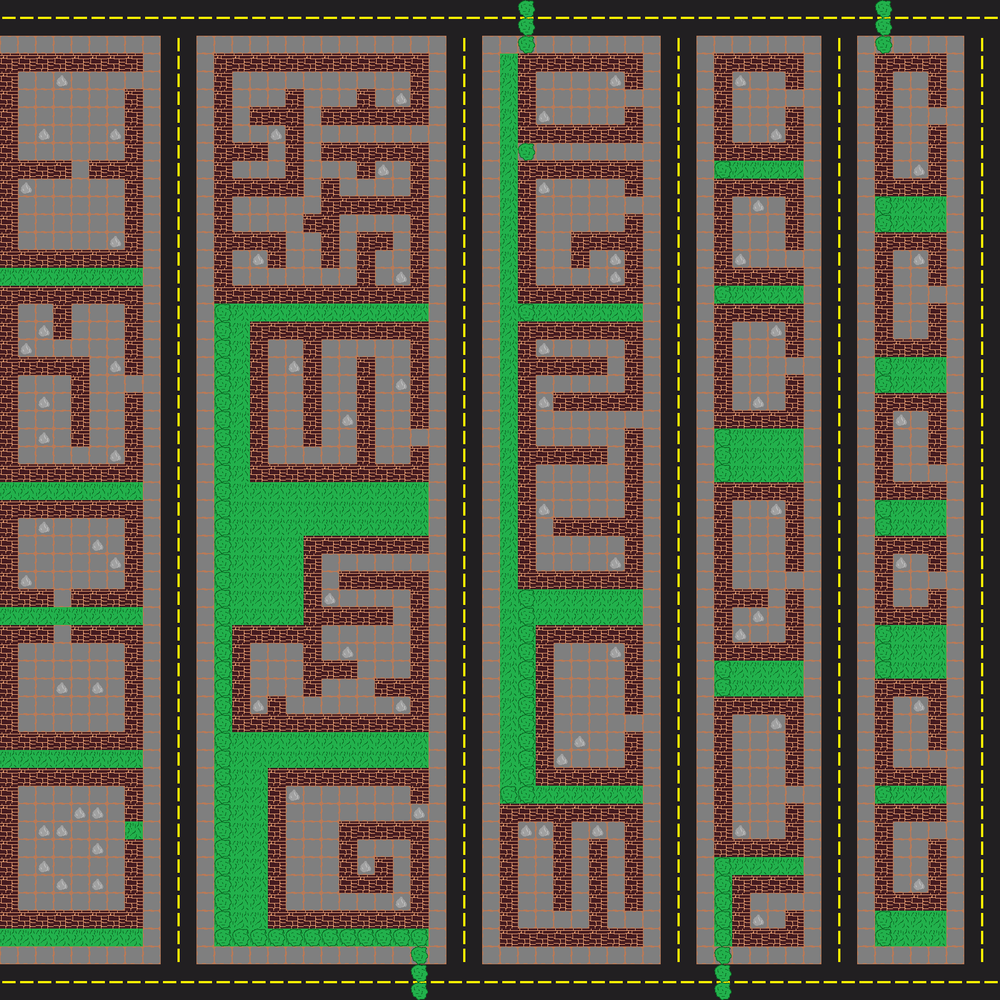

# 4.1 Evaluation of Success Criteria

## Map

### Criteria

| Criterion | Description                                                                                                                                                                                                                                                     | When was it achieved                                                                                                                                                                    |
| --------- | --------------------------------------------------------------------------------------------------------------------------------------------------------------------------------------------------------------------------------------------------------------- | --------------------------------------------------------------------------------------------------------------------------------------------------------------------------------------- |
| 1         | The map should have a bottom layer which has the road layout and other things that the player can walk over. This should have clear different parts to represent the road and make the setting of the game clear.                                               | [2.2.1-cycle-1.md](../design-and-development/2.2.1-cycle-1.md "mention")                                                                                                                |
| 2         | The second layer of the game will have things that are built on top of the floor and will mostly be made up of things that the player cannot pass through like walls. This should be noticeably different from the bottom layer so it is easy to differentiate. | [2.2.3-cycle-3.md](../design-and-development/2.2.3-cycle-3.md "mention")                                                                                                                |
| 3         | The final layers will be object layers that will consist of certain types of objects with different properties like bushes or iron.                                                                                                                             | [2.2.5-cycle-5.md](../design-and-development/2.2.5-cycle-5.md "mention")                                                                                                                |
| 4         | There will be 5 roads should be laid out to imitate the layout of a town.  Each road will have a different level of difficulty.                                                                                                                                 | [2.2.1-cycle-1.md](../design-and-development/2.2.1-cycle-1.md "mention")[2.2.10-cycle-10.md](../design-and-development/2.2.10-cycle-10.md "mention")                                    |
| 5         | The roads that are further from where the player will spawn will be harder to beat as there will be more zombies.                                                                                                                                               | [2.2.1-cycle-1.md](../design-and-development/2.2.1-cycle-1.md "mention")[2.2.10-cycle-10.md](../design-and-development/2.2.10-cycle-10.md "mention")                                    |
| 6         | The house that the player will spawn in will be their base.                                                                                                                                                                                                     | 
<a data-mention href="../design-and-development/2.2.3-cycle-3.md">2.2.3-cycle-3.md</a> <a data-mention href="../design-and-development/2.2.9-cycle-9.md">2.2.9-cycle-9.md</a>
 |
| 7         | There will be two bosses.                                                                                                                                                                                                                                       | [2.2.10-cycle-10.md](../design-and-development/2.2.10-cycle-10.md "mention")                                                                                                            |
| 8         | Spawn in vehicles to the game.                                                                                                                                                                                                                                  | Not met                                                                                                                                                                                 |

### Criterion 1

<figure><figcaption></figcaption></figure>

You can see the roads in the background. The player, enemies and the objects overlay the background. The colours are different enough so the player can distinguish between the different parts of the map.

### Criterion 2

This is shown in the last picture. Again this you can see the brick texture against the other parts of the map. As you can see none of the other components of the game like the ones stated above are intersecting with this layer of the map. On the other hand I used similar colours for the grass and the bushes which makes it more difficult to distinguish between but it is still possible.

### Criterion 3

This is shown in the picture from criterion 1. This layer is the iron layer which can be interacted with and you can pick up. The bushes were not included in an option layer as I realised that it would not be necessary as they will behave in the same way as the the second layer.

### Criterion 4

<figure><figcaption>
This is the map exported into an image from the map editor, Tiled, which shows the five different roads and the distribution of iron and the shapes of the different buildings which are created to imitate somewhat complex structures and to provide a challenge to the player.
</figcaption></figure>

There are 5 different roads in the game and they do represent a road. The game also spawns a different amount of zombies on each of the roads to make the game more difficult.

### Criterion 5

This expands on the last criterion and clarifies the difficulty levels of the game. This was achieved and was touched on in the last criterion. To achieve this I made the coordinates of the roads have different densities of zombies spawning by increasing the rates of random spawning in between these coordinates. If I had more time I would have been able to more accurately spawned in the zombies using more ranges of coordinates to make the zombies spawn further from the player at the start when they begin the game.

### Criterion 6

This criterion is shown in the picture in criterion one as the player has not moved at this point in the game. The player does spawn inside a house. This house is chosen as it is small so it provides protection from the zombies and because it is at the start of the game. This house does not serve as the players base as I made a change in the play style of the game. This is that I intended that the game would have a complex crafting system which would have meant that the player would have to take time to use but I did not have enough time to implement the menus and the logic that I would have been needed.

### Criterion 7


This is the video that I used in Cycle 10 testing which shows the boss in the game.


This was completed as I added in the boss when the player finished collecting all of the iron in the game. There originally was meant to be two bosses which I could have easily added but I decided to take a different choice in my design as I felt that one boss at the end of the game was more fitting. If the game was more difficult and longer, then I think that a second boss would have complimented the experience but because of the length of the game I decided against it.

### Criterion 8

Originally I wanted zombies to be able to drive around the map in vehicles. This did not happen as I did not have enough time to be able to make this and it was not necessary for the game to work.

## Mechanics

| Criterion | Description                                                                                                        | When was it achieved?                                                                                                                                                                   |
| --------- | ------------------------------------------------------------------------------------------------------------------ | --------------------------------------------------------------------------------------------------------------------------------------------------------------------------------------- |
| 9         | The game will need a sight which will follow the mouse of the player.                                              | Not met                                                                                                                                                                                 |
| 10        | The player should be able to fire at the position of where the mouse is. The bullets should damage the zombies.    | 
<a data-mention href="../design-and-development/2.2.8-cycle-8.md">2.2.8-cycle-8.md</a> <a data-mention href="../design-and-development/2.2.9-cycle-9.md">2.2.9-cycle-9.md</a>
 |
| 11        | The player will look at the mouse                                                                                  | 
<a data-mention href="../design-and-development/2.2.4-cycle-4.md">2.2.4-cycle-4.md</a> <a data-mention href="../design-and-development/2.2.7-cycle-7.md">2.2.7-cycle-7.md</a>
 |
| 12        | The player's movement will use the W, A, S, and D keys or the arrow keys.                                          | [2.2.2-cycle-2.md](../design-and-development/2.2.2-cycle-2.md "mention")                                                                                                                |
| 13        | The game will be top down meaning that the user will be looking down at the game like a floor plan.                | [2.2.1-cycle-1.md](../design-and-development/2.2.1-cycle-1.md "mention")                                                                                                                |
| 14        | The player will need to be able to enter vehicles and drive them.                                                  | Not met                                                                                                                                                                                 |
| 15        | The house that the player will spawn in will be their base, which they are able to craft in and defend themselves. | Not met                                                                                                                                                                                 |
| 16        | There will be two bosses.                                                                                          | [2.2.10-cycle-10.md](../design-and-development/2.2.10-cycle-10.md "mention")                                                                                                            |
| 17        | The vehicles need to provide shelter from the zombies.                                                             | Not met                                                                                                                                                                                 |
| 18        | The player will need to collect resources.                                                                         | [2.2.5-cycle-5.md](../design-and-development/2.2.5-cycle-5.md "mention")[2.2.6-cycle-6.md](../design-and-development/2.2.6-cycle-6.md "mention")                                        |

### Criterion 9

I wanted to add a sight which would act the same as the cursor to make the place that the player was firing at more clear. I did not do this as I did not have time and it was not necessary for the functionality of the game.

### Criterion 10


Video of player shooting in the direction of the mouse.


The player in the video shoots towards the direction of the mouse and in the direction that the sprite is facing. In the video of the boss in [#criterion-7](4.1-evaluation-of-success-criteria.md#criterion-7 "mention") where when he is shot many times he eventually disappears which is the death of the zombie. This criterion works well and is an overall success.

### Criterion 11


Video of the sprite rotating in relation to the position of the mouse pointer.


In the video above you can see that the player's sprite rotates to face the mouse pointer. In this video the rotating was not finished because the rotating was based on the the position the mouse was on the screen which works fine whilst in the area that you spawn in(as shown in the video above) but it means that when you go to other areas in the map the game interprets the screen coordinates to be world coordinates so it is constantly looking toward the spawn area. This means that in a later cycle I had to go back and fix it and as you can see in the video in [#criterion-7](4.1-evaluation-of-success-criteria.md#criterion-7 "mention") where ever the player the sprite will face the mouse. This criterion was overall a success.

### Criterion 12

You can see evidence for the movement in [#criterion-7](4.1-evaluation-of-success-criteria.md#criterion-7 "mention"). In my game, I decided to use the arrow keys for movement. This was an overall success and the movement does not have any bugs.

### Criterion 13

All of the images show my map which uses the top down structure. It has the brick block to represent the floor plan of a building and there are roads from a top down perspective.

### Criterion 14

This feature was not met as I decided to not add vehicles as I did not have enough time and my game was not large enough to require this.

### Criterion 15

This was also not met due to the fact that I did not have time to implement the crafting system or the and the zombies did not respawn so the player did not need to defend themselves from them.

### Criterion 16

This has the same evidence as [#criterion-7](4.1-evaluation-of-success-criteria.md#criterion-7 "mention") which show the boss. This was an overall success because I had a boss. On the other hand, I only had one boss because the game was not large enough to need to make another.

### Criterion 17

I did not choose to include vehicles for the same reason that I stated in [#criterion-14](4.1-evaluation-of-success-criteria.md#criterion-14 "mention").

### Criterion 18

This was achieved with collecting iron which is an integral part of the game and essential in progressing.
