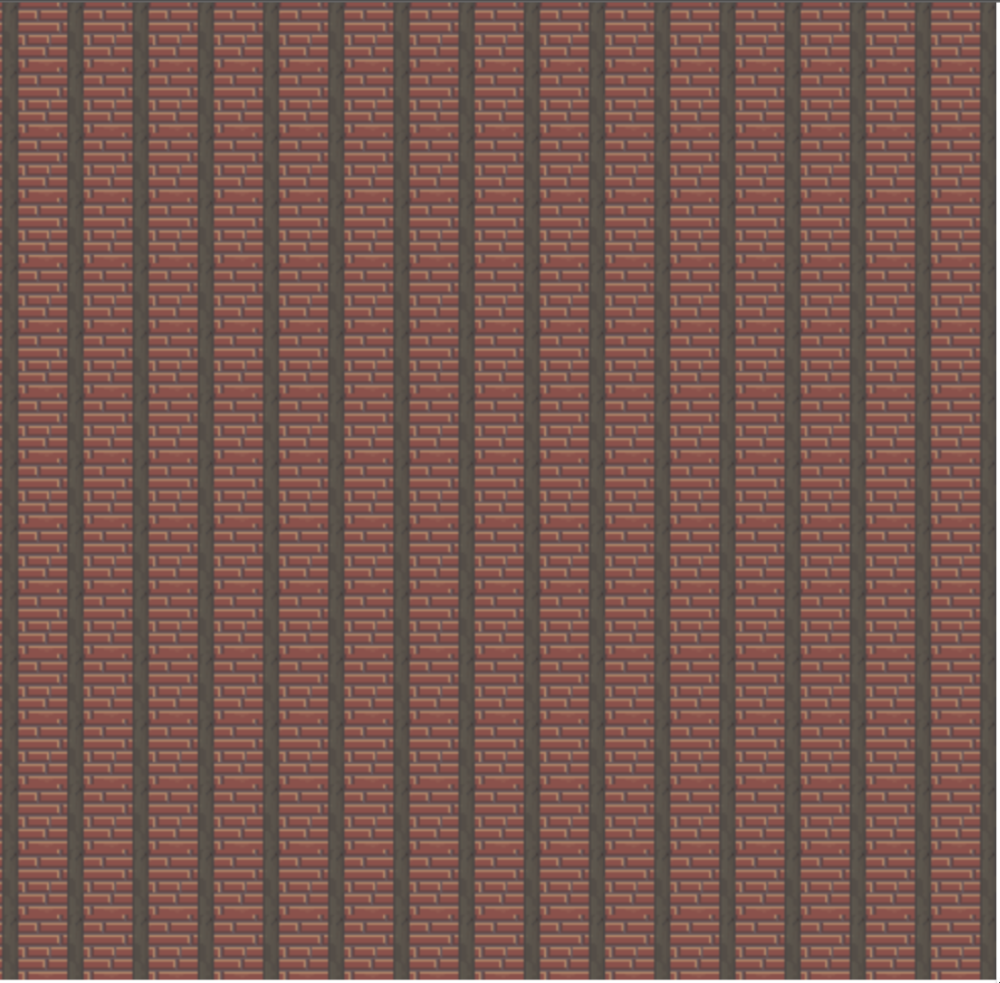

# 2.2.1 Cycle 9

## Design

### Objectives

In this cycle I want to put in the foundations for the main challenge of my game, the zombies.

* [x] Add in zombie class that will be my enemy.
* [x] Make zombies spawn.
* [x] Add colliders for the zombie
* [x] Make the zombie die when a bullet hits them.

### Usability Features

### Key Variables

| Variable Name | Use                   |
| ------------- | --------------------- |
| Zombie        | The zombie class      |
| zombie        | The individual zombie |

### Pseudocode

<pre><code><strong>class Zombie extends sprite{
</strong>    constructor (scene, x, y, texture)
    {
        super(scene, x, y, texture)
    }
    preUpdate (time, delta)
    {
        super.preUpdate(time, delta);
    }
}</code></pre>

```
define zombie

create{
    ...
    zombie = new Zombie(100,100,zombieImg)
    collider(zombie, player)
    collider(zombie, worldLayer)
}

update{
    ...
    if mouse.isDown & control == false{
        //...
        collider(zombie, bullet, zomDie())
}

zomDie(){
    destroy zombie
    destroy bullet
}
```

## Development

### Outcome

```javascript
import zomImg from './assets/zombie.png'
//...
let zombie
//...
class Zombie extends Phaser.GameObjects.Sprite {

    constructor (scene, x, y, texture)
    {
        super(scene, x, y, texture);
        this.scene.add.existing(this);

    }


    preUpdate (time, delta)
    {
        super.preUpdate(time, delta);

    }
}
//...

function create{
    zombie = new Zombie(this, 100, 100, 'zombieImg')

}
//...

function zomDie(zombie,bullet){
    zombie.destroy(zombie.x, zombie.y)
    bullet.destroy(bullet.x, bullet.y)
}

function update (){
    //...
    if (this.input.mousePointer.isDown && control == false) {
            //...
            this.physics.add.collider(bullet, zombies, zomDie)
        }
    }
}
```

### Challenges

The biggest challenge was making the class for the zombies as it was something that I had not done before in phaser.

## Testing

### Tests

| Test | Instructions         | What I expect                        | What actually happens | Pass/Fail |
| ---- | -------------------- | ------------------------------------ | --------------------- | --------- |
| 1    | Run code             | The zombie should have been created. | As expected.          | Pass      |
| 2    | Run into the zombie. | You should collide with the zombie.  | As expected.          | Pass      |
| 3    | Shoot the zombie.    | The zombie should disappear.         | As expected.          | Pass      |

### Evidence

<figure><figcaption><p>Zombie has spawned.</p></figcaption></figure>
